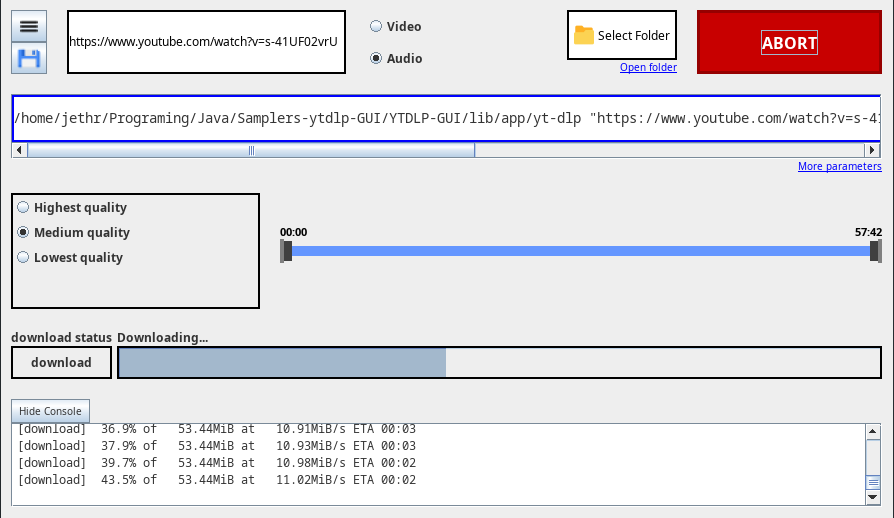

## Overview

Simple YtDLP GUI using java fx swing. has full access to ytdlp command suite by typing in manually while the buttons and text fields take care of simple usages. Also includes a timeline that will allow you to specify a specific time frame of the video to download

## Getting Started

Download the release for your specified version and run the file

installs to program files on windows or opt on linux

Has everything you need to get going, if you expereince error run it from the terminal and it will output more debugging information

## Features

Fully editable command line for ytdlp so any agrument that ytdlp supports you can use in the gui.

Hyper link to ytdlps argument page for easy access.

intuitive button layout that add arguments for the base level functions for ytdlp.

A timeline that visualizes the section the user would like to download.

Config saving, saves weather you want to use audio or video, what level quality, weather you want to see the console output or not and also saves the dimensions of the window

## Running from source

You can also run it from source but you need to have ffmpeg and ytdlp for your os either in your path or in the classes path

